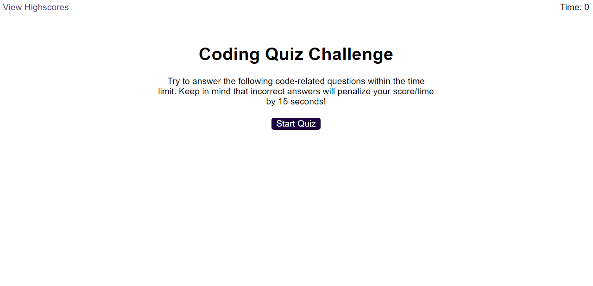
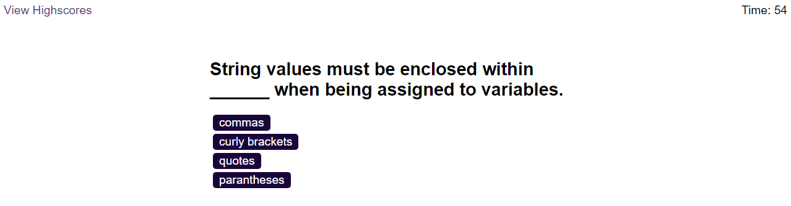
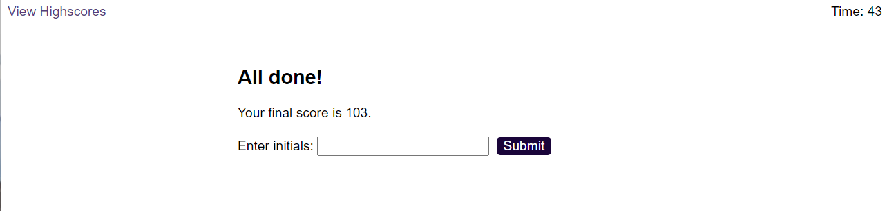
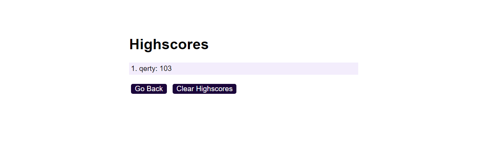

# Javascript Quiz Game

## Description

This is a Javascript Quiz Game as assigned by my Bootcap course. The Initial HTML (index.html, highscore.html), CSS (style.css), and .WAV(though not utilized) were provided by the instruction course, as the module was to show understanding of Javascript's event listeners, DOM traversal elements and localStorage. I decided to make some minor edits to the coloring but otherwise, I have opt'd not to adjust the stylesheet. 

This is a short quiz designed to test the user on their JS knowledge. It tracks time on the page, and if the user answers incorrectly, it subtracts time. It also adds that time to the final score. 

## Installation

You can run this code by opening it in your preferred code editor. 

## Usage

When you load into the start page, clicking Start Quiz wil run the quiz game. Answer the questions, and at the end you can enter your initials and have a High Score! 

To add a screenshot, create an `assets/images` folder in your repository and upload your screenshot to it. Then, using the relative filepath, add it to your README using the following syntax:

    

    

    
        

    
    

    

## Credits

"JSON.Parse()." Mdn Web Docs, 12 Apr. 2023, developer.mozilla.org/en-US/docs/Web/JavaScript/Reference/Global_Objects/JSON/parse.

"JSON.Stringify()." Mdn Web Docs, 12 Apr. 2023, developer.mozilla.org/en-US/docs/Web/JavaScript/Reference/Global_Objects/JSON/stringify.

"Array.Prototype.Sort()." Mdn Web Docs, 30 Apr. 2023, developer.mozilla.org/en-US/docs/Web/JavaScript/Reference/Global_Objects/Array/sort.

## License

MIT License

Copyright (c) [2023] [Cody S. Cooke]

Permission is hereby granted, free of charge, to any person obtaining a copy
of this software and associated documentation files (the "Software"), to deal
in the Software without restriction, including without limitation the rights
to use, copy, modify, merge, publish, distribute, sublicense, and/or sell
copies of the Software, and to permit persons to whom the Software is
furnished to do so, subject to the following conditions:

The above copyright notice and this permission notice shall be included in all
copies or substantial portions of the Software.

THE SOFTWARE IS PROVIDED "AS IS", WITHOUT WARRANTY OF ANY KIND, EXPRESS OR
IMPLIED, INCLUDING BUT NOT LIMITED TO THE WARRANTIES OF MERCHANTABILITY,
FITNESS FOR A PARTICULAR PURPOSE AND NONINFRINGEMENT. IN NO EVENT SHALL THE
AUTHORS OR COPYRIGHT HOLDERS BE LIABLE FOR ANY CLAIM, DAMAGES OR OTHER
LIABILITY, WHETHER IN AN ACTION OF CONTRACT, TORT OR OTHERWISE, ARISING FROM,
OUT OF OR IN CONNECTION WITH THE SOFTWARE OR THE USE OR OTHER DEALINGS IN THE
SOFTWARE.
